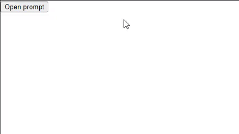

Demo of a simple react component that simulates window.prompt(). The concept is opening a modal with a function. Usually you would use a state variable to control the modal, but this is a more declarative approach.

```jsx
function App() {
  const { open, prompt } = usePrompt()
  return (
   <>
     <button
       onClick={() => prompt('initial value value')}
     >
       Open prompt
     </button>
     {prompt}
   </>
  )
}
```


